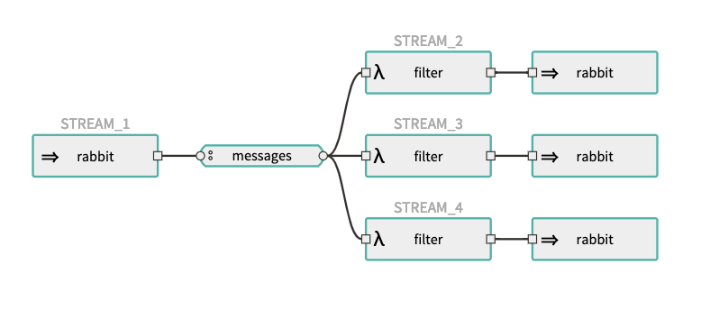

## SCDF

Spring Cloud Data Flow is a toolkit for building data integration and real-time data processing pipelines.

This folder contains a docker-compose file for running the setup locally using:

```bash
DATAFLOW_VERSION=2.0.1.RELEASE SKIPPER_VERSION=2.0.0.RELEASE docker-compose up
```

It's recommended to run with the latest Docker version.

The setup includes **three** main containers:

* `dataflow-server` - The dataflow server. Stores stream and task definitions, also stores the execution state of deployed tasks
* `skipper` - The Skipper server. Stores the execution state of deployed streams
* `scdf_rabbitmq_1` - A messaging middleware for the deployed streams to communicate, plus used in our system for our own needs

Visualization of the stream defined in this example:



### Docker Compose Customization


#### Using MySQL Rather than the H2 Embedded Database:

Add the following service:

```yaml
mysql:
  image: mysql:5.7.25
  environment:
    MYSQL_DATABASE: dataflow
    MYSQL_USER: root
    MYSQL_ROOT_PASSWORD: rootpw
  expose:
    - 3306
```

with the following properties:

```bash
- spring.datasource.url=jdbc:mysql://mysql:3306/dataflow
- spring.datasource.username=root
- spring.datasource.password=rootpw
- spring.datasource.driver-class-name=org.mariadb.jdbc.Driver
```


#### Monitoring tools:

Add the following services:

```yaml
influxdb:
  image: influxdb:1.7.4
  container_name: 'influxdb'
  ports:
    - '8086:8086'

grafana:
  image: springcloud/spring-cloud-dataflow-grafana-influxdb:${DATAFLOW_VERSION:?DATAFLOW_VERSION is not set!}
  container_name: 'grafana'
  ports:
    - '3000:3000'
```

with the following properties:

```bash
- spring.cloud.dataflow.applicationProperties.stream.management.metrics.export.influx.enabled=true
- spring.cloud.dataflow.applicationProperties.stream.management.metrics.export.influx.db=myinfluxdb
- spring.cloud.dataflow.applicationProperties.stream.management.metrics.export.influx.uri=http://influxdb:8086
- spring.cloud.dataflow.grafana-info.url=http://localhost:3000
```

### Deploying the stream

You can deploy the stream via the UI, or by connecting to the dataflow-server container and run the following:

```bash
docker exec -it dataflow-server java -jar shell.jar
  ____                              ____ _                __
 / ___| _ __  _ __(_)_ __   __ _   / ___| | ___  _   _  __| |
 \___ \| '_ \| '__| | '_ \ / _` | | |   | |/ _ \| | | |/ _` |
  ___) | |_) | |  | | | | | (_| | | |___| | (_) | |_| | (_| |
 |____/| .__/|_|  |_|_| |_|\__, |  \____|_|\___/ \__,_|\__,_|
  ____ |_|    _          __|___/                 __________
 |  _ \  __ _| |_ __ _  |  ___| | _____      __  \ \ \ \ \ \
 | | | |/ _` | __/ _` | | |_  | |/ _ \ \ /\ / /   \ \ \ \ \ \
 | |_| | (_| | || (_| | |  _| | | (_) \ V  V /    / / / / / /
 |____/ \__,_|\__\__,_| |_|   |_|\___/ \_/\_/    /_/_/_/_/_/

2.0.1.RELEASE

Welcome to the Spring Cloud Data Flow shell. For assistance hit TAB or type "help".
Successfully targeted http://localhost:9393/
dataflow:> stream create --name httptest --definition "the_stream_definition" --deploy
```
